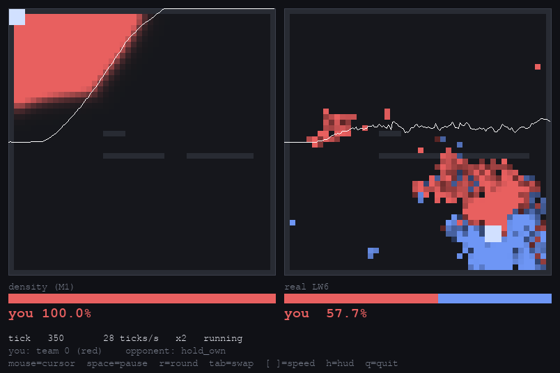

# fluxwar

Liquid War, twice over.

* **The real thing.** `liblw6ker` — the GNU Liquid War 6 game kernel — compiled from
  source and driven from Python. Not a re-implementation: the actual rules, at ~5000
  rounds/s, usable as an environment and as the arbiter for everything else.
* **A differentiable one.** The same mechanic as a continuous density field on a GPU,
  so the whole game is a reaction-advection PDE you can backpropagate through.
  4.1e4 env-steps/s batched, and every step has a gradient.

The research question is whether you can train a competitive policy by
backpropagating through the simulator, and whether that beats PPO on the same
environment. The engineering goal is a policy good enough to drop into real Liquid War
6 as a bot.

Those two pull in opposite directions — LW6's kernel is integer, branchy and
order-dependent, so it is neither differentiable nor batchable — so both engines exist
and the gap between them is measured rather than assumed
(`python -m fluxwar.eval.transfer`).

Licensed AGPLv3; `fluxwar/sim/reference.py` and the build scripts derive from GPLv3
LW6 sources. See `docs/deviations.md`.

## Play it

```bash
python -m fluxwar.play                              # you vs a scripted turtle
python -m fluxwar.play --opponent runs/ppo/policy.pt
python -m fluxwar.play --engine both                # both engines, same map, side by side
python -m fluxwar.play --engine lw6                 # play the real game
```



Mouse moves your cursor. `space` pause, `r` new round, `tab` swap sides, `[` `]` sim
speed, `h` hide the HUD, `q` quit. `--auto <agent>` drives your side with a scripted
agent, and `--frames N --shot out.png` runs headless.

## Build the real kernel

```bash
python -m fluxwar.lw6.build --out build/lw6     # clones LW6 if needed, ~2s to compile
```

Everything that touches the real game skips cleanly if this is missing. See
`docs/lw6-kernel.md` for what gets built and the five non-obvious things needed to
make it work.

## Layout

```
fluxwar/
  lw6/             the real Liquid War 6 kernel
    build.py       compiles liblw6ker.so from the LW6 sources
    kernel.py      ctypes binding
    env.py         one real game, in the same interface the density sim uses
    vecenv.py      many real games across processes, for training
    csrc/          helpers compiled in so struct layouts come from the compiler
  sim/             the differentiable density sim
    core.py        the pure functional tick -- field, advection, combat
    env.py         batched episode loop, reset, scoring
    observation.py the one definition of what a policy sees
    maps.py        procedural map generation (used by both engines)
    reference.py   a readable Python port of the LW6 kernel; not the ground truth
    dynamics.py    the original spec's combat rule, kept only as a counterexample
  policy/
    net.py         CNN policy + value head (~90k params)
    ppo.py         M2, on either engine
    bptt.py        M3, backprop through the differentiable sim
    agents.py      scripted baselines and policy wrappers
  eval/
    fidelity.py    density sim vs the real kernel
    transfer.py    the same matchup in both, to measure the gap
    validate_port.py  the Python port vs the real kernel
    arena.py       head-to-head, side-swapped, Elo
    bench.py       throughput
    compare.py     M4
    render.py      density field -> mp4
  play.py          interactive player
configs/           all hyperparameters
docs/              lw6-kernel, fidelity, action-spaces, deviations, deployment, results
```

## Running things

```bash
pytest fluxwar/tests -q -m "not slow"     # fast suite
pytest fluxwar/tests -q                   # adds the real-kernel comparisons
python -m fluxwar.eval.bench              # throughput
python -m fluxwar.policy.ppo  --env density --max-seconds 3600 --out runs/ppo
python -m fluxwar.policy.ppo  --env lw6   --max-seconds 3600 --out runs/ppo_lw6
./scripts/train_vs_brute.sh 10800         # both action spaces vs unconstrained mod-brute
python -m fluxwar.policy.bptt --max-seconds 3600 --out runs/bptt
python -m fluxwar.policy.bptt --grad-report
python -m fluxwar.eval.transfer --policy runs/ppo/policy.pt --against chase_enemy
python -m fluxwar.eval.agent_fidelity     # do both engines score matchups the same?
python -m fluxwar.eval.validate_port      # the Python port vs the real kernel
./scripts/m4.sh 2700                      # M4: PPO and BPTT, matched wall clock

# deploy: export weights, then play real games through LW6's own bot interface
python -m fluxwar.deploy.export --policy runs/ppo/policy.pt --out build/policy.flxw
python -m fluxwar.eval.deployed --weights build/policy.flxw --against brute follow
```

## The headline

At matched wall clock on the same simulator, backpropagating through the simulator
(M3) beat PPO (M2) head to head **0.94** on decisive games, using **16x fewer
environment steps**. Against a fixed scripted baseline the two are indistinguishable,
which is the metric the original brief asked for and the one that hides the
difference. One seed each; full caveats in `docs/results.md`.

## What it does and does not do

The policy beats LW6's `mod-follow` bot in real games (0.79 share) and is about even
with `mod-brute` when both cursors move at the same speed (0.44). Uncapped,
`mod-brute` teleports its cursor anywhere on the map each round and wins decisively.
The density sim agrees with the real kernel on who wins most matchups but
over-rewards aggression, mean |delta share| 0.24. Full numbers and the milestone
scorecard are in `docs/results.md`; `docs/next-steps.md` says what to do about it.

All hyperparameters live in `configs/`, not in source. The density sim is batched
throughout — no single-game code path, and no gym interface, whose one-env-per-step
API would force a copy out of the GPU-resident batch.
