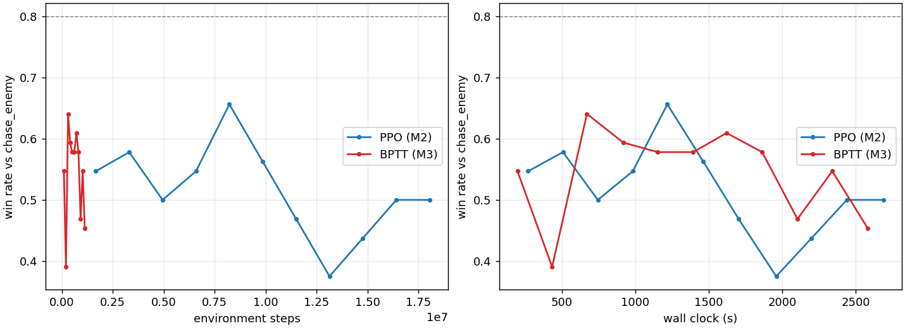

# Results

Measured on this machine (RTX 3090, 12 cores). Every "real LW6" figure comes from
`liblw6ker` compiled from the GNU Liquid War 6 sources and driven directly — not from
a re-implementation.

**Configuration provenance.** The simulator changed several times while these were
being taken, so each section says what it was measured under. Unless noted otherwise,
numbers are at `MAX_CURSOR_SPEED = 1`, which was the default until the dead-game
measurement in `docs/fidelity.md` moved it to 4. The M2/M3/M4 training numbers and
the deployment table predate that change; the fidelity numbers were re-measured
after it and are unchanged at 0.234 against 0.242.

## Throughput

| engine | rate |
| --- | --- |
| differentiable density sim, B=512, 64x64, compiled | 4.1e4 env-steps/s |
| real LW6 kernel, one game | ~5200 rounds/s |
| real LW6 kernel, one game with observations built | ~1900 rounds/s |
| real LW6, 12 worker processes (`lw6.vecenv`) | ~6.3e3 env-steps/s |
| BPTT through the density sim (M3) | ~470 env-steps/s |

The density sim ran above 1.8e5 env-steps/s before exclusion became a real constraint
and `acts_per_tick` was set to LW6's value of 2. Both were needed for fidelity, so the
spec's 1e5 target is no longer met; the fixed-point iteration in `advect` is where the
time goes.

BPTT is ~90x slower per environment step than PPO on the same simulator, because a
differentiable rollout has to keep or recompute a window of activations. A per-step
advantage from the analytical gradient has to be large to pay for that.

## Fidelity: density sim vs the real kernel

Two metrics. The second exists because the first missed the failure that mattered.

**Population curve**, one fixed cursor script, relative to the reference's own
departure from 0.5: **~0.34** mean over four maps (the spec asked for 0.10).

**Matchup outcome** (`eval/agent_fidelity.py`) — the same scripted agents, the same
maps, *and the kernel's own starting placement* in both engines, compared on final
population share: **0.24** mean absolute difference, worst case 0.85.

The dominant error is one-sided and worth stating plainly: the density sim
over-rewards aggression. On `chase_enemy vs hold_own` it hands the attacker 1.00
where the real kernel scores 0.43 and 0.14. A policy trained against that learns
charging is free, which is exactly the "they'll learn the wrong task" failure.

Two measurement traps hit along the way, both of which produced better-looking and
wrong numbers:

* Letting each engine choose its own **starting positions** while matching only the
  map. On one map the density spawns left the armies unable to reach each other and
  every matchup returned exactly 0.500, which scored as good agreement. Matching the
  placement moved the measured gap from 0.16 to 0.24 — the better number was the
  broken one.
* Tuning against a hand-written Python port instead of the real kernel. Two full
  parameter sweeps optimised against a reference that itself diverges 66% from LW6.

## Where the free parameters landed

Mostly on the values the source dictates, which is the outcome you want from a sweep
over a physical model. `acts_per_tick = 2` is LW6's `moves_per_round`; `RATE_DT =
0.05`, `DEFEND_DT = 0.005` and `REGEN_DT = 0.0005` are `fighter_attack`,
`fighter_defense` and `fighter_regenerate` over `max_fighter_health`; `capacity = 1`
is one fighter per cell.

`attack_isotropy = 0.6` is the one genuinely new parameter. A purely directional
attack — mass fights only where its cursor pulls it — leaves a defender facing its
own cursor unable to fight back at all, and the sweep prefers a mix (0.6 beats both 0
and 1.0). That matches LW6, where a blocked fighter tries three of its twelve fan
directions for an enemy.

Raising the defence term 12x above LW6's ratio buys 0.242 → 0.212. Not taken: a 0.03
improvement is not worth abandoning a constant read out of the source.

## Policies, in real Liquid War 6

`mod-nn` is the trained policy as a real LW6 bot — weights exported to a flat binary,
forward pass in dependency-free C (agrees with PyTorch to 1.2e-7), cursor driven
through the same path the game uses. The numbers below are `runs/ppo/policy.pt`, a
45-minute PPO run on the density sim at `MAX_CURSOR_SPEED = 1`, exported with
`--cursor-speed 1.0`.

| matchup | mod-nn's share |
| --- | --- |
| vs `mod-follow` | 0.79 |
| vs a stationary cursor | 0.67 |
| vs `mod-brute`, cursor capped to 1 cell/round | 0.44 (50% wins) |
| vs `mod-brute`, capped to 2 | 0.42 |
| vs `mod-brute`, capped to 4 | 0.17 |
| vs `mod-brute`, uncapped | 0.04 |

`mod-brute` keeps a sandbox copy of the game state, rolls it forward to score
candidate cursor positions, and **teleports** the cursor anywhere on the map each
round (`cursor.pos.x = lw6sys_random(sys_context, shape.w)`). Uncapped it takes 0.92
against `mod-follow` and 0.996 against a stationary cursor, so it is not a weak
benchmark. The policy is about even with it at equal cursor mobility and loses as
that advantage grows: the remaining gap is an action-space asymmetry as much as a
policy one.

Two comparisons that did not go the way you would expect, both worth treating as
statements about short runs rather than about methods:

* **Training on real LW6 games did not help.** 0.37 against capped `mod-brute`
  versus 0.48 for the density-trained policy, despite no sim-to-real gap at all. That
  run's entropy collapsed to 0.15, so it most likely overfitted its self-play pool.
* **The M4 winner is not the best deployed policy.** `runs/m4_bptt`, which beats PPO
  0.94 head to head on the simulator, gets 0.27 against capped `mod-brute` where the
  older PPO checkpoint gets 0.48. It trained for 45 minutes on `soft.yaml`, whose
  temperature differs from the deployment config.

Neither result should be read as "the density sim is better than the real game to
train on" or "BPTT policies transfer badly". They say that at this scale of training
the run-to-run variation is larger than the effects being compared, which is itself
the most important caveat on every number here.

## Transfer

`eval/transfer.py` plays the same matchup in both engines. Density-trained policy
against `chase_enemy`: 0.83 win rate in the density sim, 0.67 in real LW6, mean-share
gap 0.064. For scripted agents the two engines agree on the winner, gap 0.024.

## M3: what the analytical gradient actually does

It trains. Share against the scripted baseline rose from 0.45 to a peak of 0.59 (0.70
win rate), so the milestone's bar — loss decreases, policy beats the baseline — is met.
It is also unstable, swinging back to 0.47 between evaluations.

The interesting failure is not the explosion the brief expects. Gradient norms are
heavy-tailed (median ~1e-3, p99 ~1e-1) *and* **8 of 89 windows came back at exactly
zero**. The objective is the change in population share, which is identically zero
while the armies are out of contact, so a truncated window containing no fighting
carries no signal at all — not a small one, none. PPO is unaffected because its value
function bootstraps across the gap.

## M4: backprop through the simulator vs PPO

Both trained on the same simulator, the same config (`soft.yaml` as it stood, at
`MAX_CURSOR_SPEED = 1`) and the same wall-clock budget (`scripts/m4.sh 2700`),
evaluated every 50 iterations over 64 side-swapped games against `chase_enemy`.

| | mean win rate over 11 evals | best | env-steps | wall |
| --- | --- | --- | --- | --- |
| PPO | 0.516 ± 0.072 | 0.656 | 18,055,168 | 2688 s |
| BPTT | 0.544 ± 0.072 | 0.641 | 1,128,448 | 2584 s |

Against the fixed baseline the two are indistinguishable — the binomial standard
error at 64 games is 0.062 and neither shows a trend inside the budget. **BPTT gets
there on 16x fewer environment steps.**

Played against each other and against the whole scripted set, they are not
indistinguishable at all. Decisive win rates (draws excluded, sides swapped, 64 games
each):

| | vs PPO | vs chase_enemy | vs hold_own | vs lean2 | vs lean5 |
| --- | --- | --- | --- | --- | --- |
| PPO | — | 0.51 | 0.08 | 0.14 | 0.20 |
| BPTT | **0.94** | 0.54 | 0.61 | 0.51 | 0.54 |

BPTT beats PPO 0.80 to 0.05 head to head (the rest draws) and is at or above parity
with every scripted agent, while PPO loses to three of the four. So on this task, at
matched wall clock, backpropagating through the simulator produced the better policy
— and did it on a sixteenth of the experience.

That is a real answer to the question the project was set up to ask, with real
caveats attached. One seed each. Both plateau near 0.5 against a baseline the tuned
physics made much stronger (on the earlier, less faithful configuration PPO reached
0.95 against the same agent). Draw rates are high — 0.4 against the turtles — because
at one cell per round many games never make contact inside the evaluation episode,
which wastes both training signal and evaluation resolution. And the win rate against
a fixed baseline, the metric the milestone asked for, is exactly the metric that says
the two are equal; the head-to-head is what separates them.

## Two agents against an unconstrained mod-brute

The controlled version of "can we beat the bot the game ships with". Both agents:
PPO, real LW6 games in worker processes, opponent `mod-brute` with **no** cap on its
cursor (it teleports, driven natively inside each worker), 3 hours each, same maps,
same budget. The only difference is what the agent's own cursor may do.

Training, share of the population against brute:

| | steps | first eval | best | final | best win rate |
| --- | --- | --- | --- | --- | --- |
| **velocity** (human constraint) | 8.14M | 0.079 | 0.080 | 0.078 | 0.017 |
| **target** (bot constraint) | 7.84M | 0.053 | 0.271 | 0.227 | 0.217 |

Deployed in the real game, opponents unconstrained (12 games, 600 rounds, 64x64):

| | vs `mod-brute` | vs `mod-follow` | vs stationary |
| --- | --- | --- | --- |
| velocity | 0.099 / 8% wins | 0.446 / 33% | 0.544 / 58% |
| target | 0.141 / 17% wins | 0.773 / 83% | 0.595 / 67% |

**Neither beats mod-brute.** But the separation is not subtle. Over 8.1 million steps
the velocity agent never won a single training game against it -- its share was 0.079
at the first evaluation and 0.078 at the last, fifty-three evaluations later, with no
trend in between. The target agent climbed from 0.053 to 0.27 within the first three
million steps and now takes roughly one game in five.

Same opponent, same budget, one variable. On this matchup the action space decides
the outcome, not the policy.

Two honest qualifications. The deployed number for the target agent (0.141) is below
its training evaluation (0.227) and below a mid-run spot check (0.212); episode
length and map draw differ between the harnesses and 12 games is a wide interval, so
treat 0.14-0.23 as the range rather than any single figure. And the velocity agent
trained only against brute is *worse* against `mod-follow` (0.446) than the earlier
policy trained on the density sim (0.727) -- training exclusively against an opponent
that gives you no signal produces a poor general policy, not just a poor
anti-brute one.

For what a bounded cursor can achieve at all, independent of learning, see
`docs/action-spaces.md`: hand-written velocity policies score roughly 0.01 to 0.13
against the same opponent, with enough variance that the trained agent's 0.05-0.10
is not distinguishable from them.

## A hypothesis that did not survive contact

The density sim's biggest error is one-sided: it over-rewards aggression. The obvious
explanation is that it has no health dimension, so a conversion is permanent the
instant it happens, where in LW6 a converted fighter respawns at half health inside
the enemy blob and is usually converted straight back.

So I built it. `sim.track_health` carries a health stock per team per cell, advected
with the mass under the same fractions and acceptance, with mass flipping at the rate
health crosses zero. It conserves mass, keeps health in [0, 1], and is tested.

It scores **0.31 on the matchup metric against 0.24 without it** — worse, across a
sweep of isotropy and rate. It is off by default and the code is kept because the
negative result is worth being able to reproduce.

The likely reason is that a *mean* health per cell cannot represent the mechanism it
was built for: the churn is individual, and the health distribution at a contested
front is bimodal, not clustered around a mean. `docs/next-steps.md` suggests two mass
bands per team as the cheapest representation that could express that.

## Milestones against the original spec

| milestone | status |
| --- | --- |
| M0 discrete reference | superseded — the real LW6 kernel is linked instead; the hand port measures 66% divergence from it (`eval/validate_port.py`) |
| M1 mass conservation | met: 1.2e-4 in float32 over 2000 ticks, 1.3e-6 in float64, so what remains is rounding |
| M1 fidelity within 10% | **not met**: ~0.34 on curves, 0.24 on matchup outcome |
| M1 throughput > 1e5 env-steps/s | **not met**: 4.1e4, traded for the exclusion constraint |
| M2 PPO beats the scripted baseline > 80% | met on the earlier configuration (0.95 peak); on the tuned physics `chase_enemy` is far stronger and PPO reaches ~0.55 |
| M3 BPTT trains at all | met, unstably; see above |
| M4 comparison | done: equal on win rate against a fixed baseline, but BPTT beats PPO 0.94 head to head on 16x fewer environment steps |
